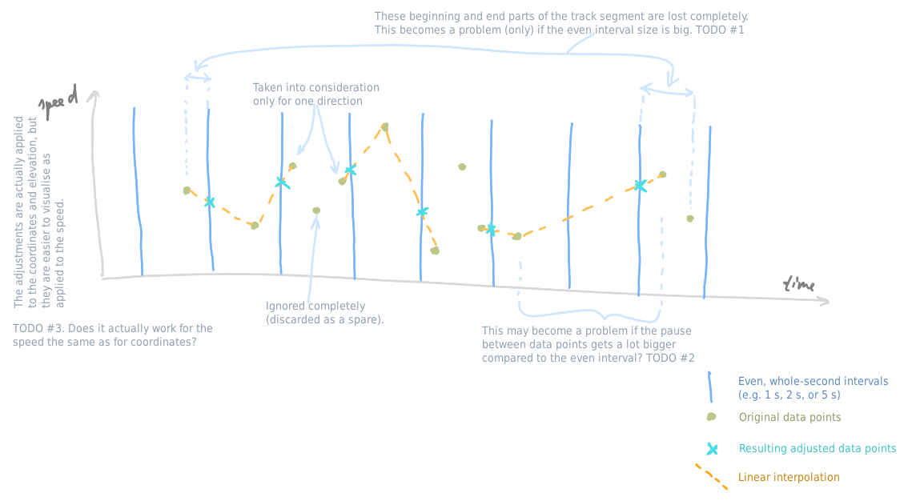
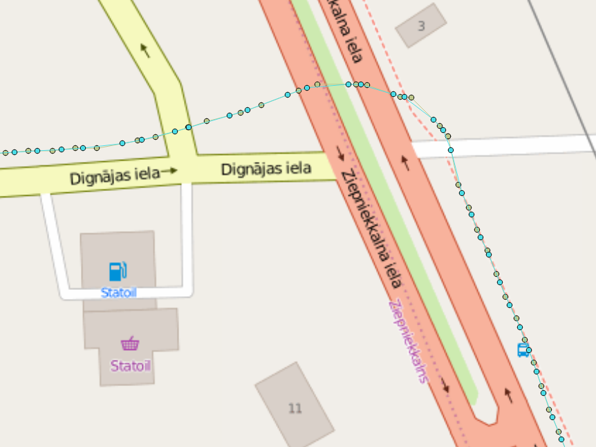
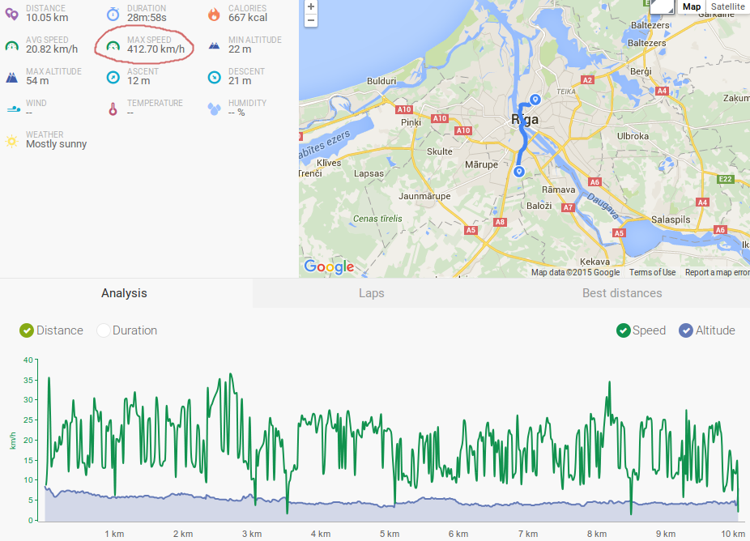
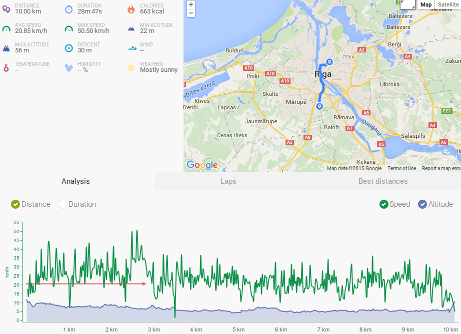
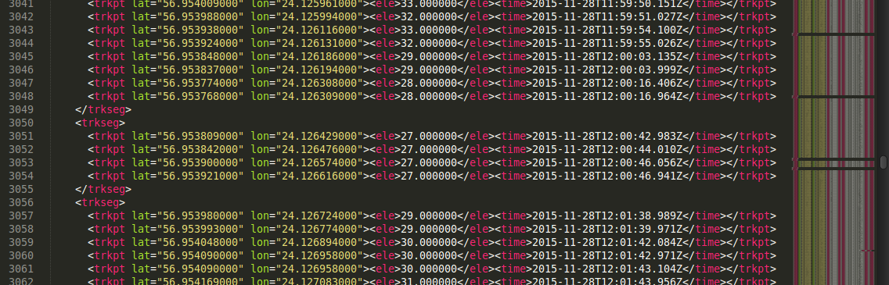

# GpxDataImprover — GPX Average Speed Increaser and Endomondo Graph and Stats Improver

## Install

```bash
git clone https://github.com/JanisE/gpx-data-improver.git
cd gpx-data-improver
npm install --production
```

Now, it's installed in that particular folder. No instructions on how to do it globally.

### Development notes

Run ```npm install``` instead to include all additional dependencies used for testing and building.

```grunt``` runs Grunt tasks (Mocha functionality tests, JSHint code correctness tests).

```gulp``` runs Gulp tasks (generates some docs).

### Prerequisites

As you can see, to install you need to run commands `git` and `npm`, and to use — `nodejs` (or `node`). These have to be installed first if not already available.

For Windows users,
* for `git`, go to https://git-scm.com/, "Downloads for Windows" and install;
* for `node` and `npm`, go to https://nodejs.org/, download and install (includes `npm`).

## Usage

You can get the usage help from the program by running `nodejs main`.

Usage examples:
```bash
nodejs ./main.js --source test/split_at_gaps_in.gpx --split_at_gaps
nodejs main --source test/even_out_in.gpx --even
/usr/bin/nodejs ./main.js --source test/split_at_gaps_in.gpx --split_at_gaps > testnew.gpx
```

Examples of not outputting the modified GPX, but stats only:
```
nodejs main --source test/split_at_gaps_in.gpx --stats
nodejs main --source test/split_at_gaps_in.gpx --split_at_gaps --even --stats

```

Note: NodeJS is available as `nodejs` in some distributions, as `node` in others.

## Splitting at gaps (improving average speed)

MyTracks, for example, does a pretty good job at detecting if you have stopped. In GPX file it results as two adjoining trackpoints being quite apart time-wise (e.g. being 43 seconds apart, while you're waiting for the green light at a crossing). Note: this program does not do such movement detection, it only takes advantage of it!

However, both those trackpoints are still within the same track segment, and Endomondo will count that standing time towards your average track speed. Not fair.

What GpxDataImprover's `--split_at_gaps` does is it splits the original track segment into several segments so that pauses bigger than 22 seconds are not included in any of them.

An additional benefit (in combination with the formatting ([Formatting](#formatting))) is an easier manual removal of unneeded trackpoints during moving inside buildings, when you are not exactly standing still, so the movement detection still stores some trackpoints here and there: they are now already grouped into segments and some of them are already removed completely (one-point segments are dropped).

## Even-out algorithms

I guess that Endomondo does not deal with milliseconds in GPX files, resulting in ugly graphs, unreal maximum speeds etc. GpxDataImprover's `--even` is an attempt to adjust the GPX data so that the trackpoints are set exactly on whole seconds, optionally spaced out in intervals not shorter than several (not one) seconds (trying to achieve an effect of a smoother movement).

### discard_spares

If there are several trackpoints within the same second (or within the several seconds' interval), the first and the last ones are used to determine the position and elevation of the trackpoint (on whole seconds) (by linear interpolation), the rest of the trackpoints are ignored completely.



Here is an example of where the adjusted points appear on the map as opposed to the original track points (the difference from the actual track seems negligible):



Here is an example of a MyTracks track imported into Endomondo before and after applying evening out using the discard_spares algorithm (with 1 s intervals).

Before:



After:



Notice that we can actually see now in the graph why the average speed is about 20 km/h. Also, the maximum speed has decreased from the unreal 412 km/h to 50 km/h, which is still too high but at least more real.

### average_intervals

The position and elevation of a trackpoint is determined by averaging the data of the related second (or the several seconds' interval).

(TODO all details)
(TODO drawing)

## Formatting

The output is formatted so that it's easy to overview in a text editor and so that it can get imported to Endomondo:



## Analysing GPX

Adding a `--stats` parameter causes not to output the resulting GPX content, but some stats (total distance, total duration and average speed) instead, which works also for unmodified (no other parameters beside `--source`) GPX sources, e.g.:
```
$ nodejs main --source test/split_at_gaps_in.gpx --stats
{ 'Total length, km': 0.04,
  'Total duration, min': 0.57,
  'Average speed, km/h': 4.2 }
```
